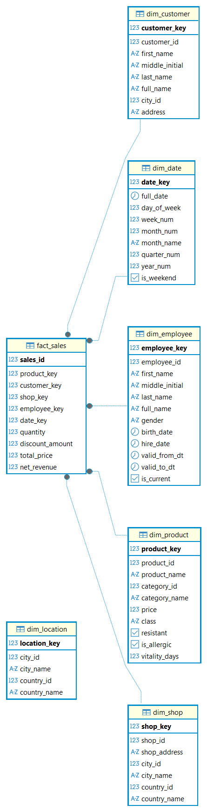
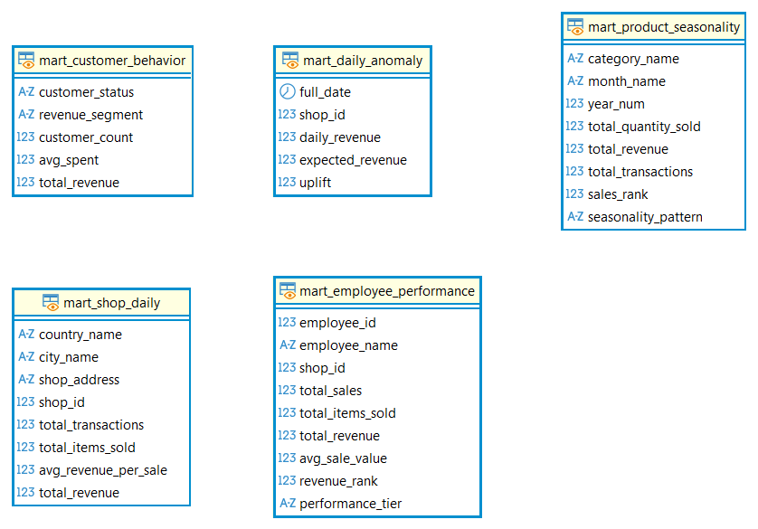

# 📚 ДОКУМЕНТАЦИЯ ПО ПРОЕКТУ ETL ДЛЯ ECOMARKET

## 1. ОБЩЕЕ ОПИСАНИЕ ПРОЕКТА

### 1.1 Название проекта
**EcoMarket Data Warehouse** — построение аналитического хранилища данных для сети продуктовых магазинов EcoMarket.

### 1.2 Цель проекта
Создание полного ETL-процесса для трансформации сырых данных в аналитическую модель, готовую для BI-аналитики и построения дашбордов.

### 1.3 Архитектура
Проект реализует **медальонную архитектуру** (Medallion Architecture) с тремя слоями:

| Слой | Назначение | Описание |
|------|------------|----------|
| **Bronze** | Сырые данные | Данные загружаются "как есть" из CSV-файлов |
| **Silver** | Очищенные данные | Данные очищены, типизированы, дедуплицированы |
| **Gold** | Аналитическая модель | Схема "Звезда" для бизнес-аналитики |
| **Mart** | Витрины данных | Денормализованные представления для BI |

---

## 2. БИЗНЕС-ПРОЦЕСС

### 2.1 Описание бизнес-процесса
**Анализ розничных продаж сети продуктовых магазинов EcoMarket.**

Основные бизнес-вопросы:
- Сколько продаж совершается ежедневно/ежемесячно?
- Какие товары продаются лучше всего?
- Какие клиенты приносят максимальную выручку?
- Какие сотрудники наиболее эффективны?
- Есть ли сезонность в продажах?

### 2.2 Зерно (Grain)
**Одна строка в таблице фактов = одна транзакция (один чек)**

Обоснование:
- Максимальная детализация для гибкой аналитики
- Возможность агрегации по любым измерениям
- Исключение двойного счёта

---

## 3. СТРУКТУРА ДАННЫХ

### 3.1 Схема Bronze (Сырые данные)

**Схема:** `public`

**Таблицы:**

| Таблица | Описание | Количество строк |
|---------|----------|------------------|
| countries | Страны | 5 |
| cities | Города | 21 |
| categories | Категории товаров | 15 |
| products | Товары | 505 |
| shops | Магазины | 72 |
| employees | Сотрудники | 326 |
| customers | Клиенты | 100 000 |
| sales | Продажи | 1 999 700 |

---

### 3.2 Схема Silver (Очищенные данные)

**Схема:** `silver`

**Особенности:**
- Приведены типы данных (DATE, TIMESTAMP, NUMERIC, BOOLEAN)
- Исправлены некорректные даты
- Удалены дубликаты

**Таблицы:**

| Таблица | Описание | Количество строк |
|---------|----------|------------------|
| silver_countries | Страны | 5 |
| silver_cities | Города | 21 |
| silver_categories | Категории товаров | 15 |
| silver_products | Товары (BOOLEAN, NUMERIC) | 505 |
| silver_shops | Магазины | 72 |
| silver_employees | Сотрудники (DATE) | 326 |
| silver_customers | Клиенты | 100 000 |
| silver_sales | Продажи (TIMESTAMP) | 1 999 700 |

**Трансформации в Silver:**
1. **Даты:** Некорректные даты (например, `2023-99-99`) заменены на `1900-01-01`
2. **Boolean:** `resistant` и `is_allergic` преобразованы из VARCHAR в BOOLEAN
3. **Числа:** Цены и скидки приведены к NUMERIC(10,2)
4. **Очистка:** Удалены дубликаты и "сиротские" записи

---

### 3.3 Схема Gold (Аналитическая модель "Звезда")

**Схема:** `gold`

#### Таблица фактов

**`fact_sales`** — продажи (1 999 700 строк)

| Поле | Тип | Описание |
|------|-----|----------|
| sales_id | INTEGER | Первичный ключ |
| product_key | INTEGER | Внешний ключ → dim_product |
| customer_key | INTEGER | Внешний ключ → dim_customer |
| shop_key | INTEGER | Внешний ключ → dim_shop |
| employee_key | INTEGER | Внешний ключ → dim_employee |
| date_key | INTEGER | Внешний ключ → dim_date |
| quantity | INTEGER | Количество товаров |
| discount_amount | NUMERIC(10,2) | Сумма скидки |
| total_price | NUMERIC(10,2) | Цена без скидки |
| net_revenue | NUMERIC(10,2) | Чистая выручка |

**Метрики:**
- `discount_amount = total_price * discount`
- `net_revenue = total_price - discount_amount`

---

#### Таблицы измерений

**1. `dim_date`** — измерение дат (730 строк)

| Поле | Тип | Описание |
|------|-----|----------|
| date_key | INTEGER | Первичный ключ (YYYYMMDD) |
| full_date | DATE | Полная дата |
| day_of_week | INTEGER | День недели (1-7) |
| week_num | INTEGER | Номер недели |
| month_num | INTEGER | Месяц (1-12) |
| month_name | VARCHAR(20) | Название месяца |
| quarter_num | INTEGER | Квартал (1-4) |
| year_num | INTEGER | Год |
| is_weekend | BOOLEAN | Выходной? |

**2. `dim_product`** — измерение товаров (505 строк)

| Поле | Тип | Описание |
|------|-----|----------|
| product_key | INTEGER | Суррогатный ключ |
| product_id | INTEGER | Бизнес-ключ |
| product_name | VARCHAR(200) | Название |
| category_id | INTEGER | ID категории |
| category_name | VARCHAR(100) | Название категории |
| price | NUMERIC(10,2) | Цена |
| class | VARCHAR(50) | Класс |
| resistant | BOOLEAN | Устойчивый? |
| is_allergic | BOOLEAN | Аллергенный? |
| vitality_days | INTEGER | Срок годности |

**3. `dim_customer`** — измерение клиентов (100 000 строк)

| Поле | Тип | Описание |
|------|-----|----------|
| customer_key | INTEGER | Суррогатный ключ |
| customer_id | INTEGER | Бизнес-ключ |
| first_name | VARCHAR(50) | Имя |
| middle_initial | VARCHAR(50) | Отчество |
| last_name | VARCHAR(50) | Фамилия |
| full_name | VARCHAR(200) | Полное имя |
| city_id | INTEGER | ID города |
| address | VARCHAR(200) | Адрес |

**4. `dim_shop`** — измерение магазинов (72 строки)

| Поле | Тип | Описание |
|------|-----|----------|
| shop_key | INTEGER | Суррогатный ключ |
| shop_id | INTEGER | Бизнес-ключ |
| shop_address | VARCHAR(200) | Адрес |
| city_id | INTEGER | ID города |
| city_name | VARCHAR(100) | Город |
| country_id | INTEGER | ID страны |
| country_name | VARCHAR(100) | Страна |

**5. `dim_employee`** — измерение сотрудников (326 строк)

| Поле | Тип | Описание |
|------|-----|----------|
| employee_key | INTEGER | Суррогатный ключ |
| employee_id | INTEGER | Бизнес-ключ |
| first_name | VARCHAR(50) | Имя |
| middle_initial | VARCHAR(50) | Отчество |
| last_name | VARCHAR(50) | Фамилия |
| full_name | VARCHAR(200) | Полное имя |
| gender | VARCHAR(10) | Пол |
| birth_date | DATE | Дата рождения |
| hire_date | DATE | Дата найма |
| valid_from_dt | DATE | Начало действия (SCD2) |
| valid_to_dt | DATE | Конец действия (SCD2) |
| is_current | BOOLEAN | Текущая запись |

**Тип SCD:** Type 2 (Slowly Changing Dimension)

**6. `dim_location`** — измерение локаций (21 строка)

| Поле | Тип | Описание |
|------|-----|----------|
| location_key | INTEGER | Суррогатный ключ |
| city_id | INTEGER | Бизнес-ключ |
| city_name | VARCHAR(100) | Город |
| country_id | INTEGER | ID страны |
| country_name | VARCHAR(100) | Страна |

---

### 3.4 Схема Mart (Витрины данных)

**Схема:** `mart`

#### 1. `mart_daily_anomaly` (52 559 строк)
**Описание:** Анализ отклонений ежедневной выручки магазина от ожидаемой.

| Поле | Тип | Описание |
|------|-----|----------|
| full_date | DATE | Дата |
| shop_id | INTEGER | ID магазина |
| daily_revenue | NUMERIC | Фактическая выручка |
| expected_revenue | NUMERIC | Ожидаемая выручка (средняя за 30 дней) |
| uplift | NUMERIC | Отклонение в % |

**Использование:** График отклонений выручки

---

#### 2. `mart_shop_daily` (72 строки)
**Описание:** Анализ географического распределения и результативности магазинов.

| Поле | Тип | Описание |
|------|-----|----------|
| country_name | VARCHAR | Страна |
| city_name | VARCHAR | Город |
| shop_address | VARCHAR | Адрес магазина |
| shop_id | INTEGER | ID магазина |
| total_transactions | INTEGER | Количество транзакций |
| total_items_sold | INTEGER | Количество товаров |
| avg_revenue_per_sale | NUMERIC | Средний чек |
| total_revenue | NUMERIC | Общая выручка |

**Использование:** Карта магазинов, столбчатая диаграмма

---

#### 3. `mart_customer_behavior` (3 строки)
**Описание:** Ранжирование клиентской базы по активности и выручке.

| Поле | Тип | Описание |
|------|-----|----------|
| customer_status | VARCHAR | Статус (Active/At Risk/Inactive) |
| revenue_segment | VARCHAR | Сегмент по выручке |
| customer_count | INTEGER | Количество клиентов |
| avg_spent | NUMERIC | Средняя выручка |
| total_revenue | NUMERIC | Общая выручка |

**Использование:** Круговая диаграмма

---

#### 4. `mart_employee_performance` (318 строк)
**Описание:** Эффективность сотрудников.

| Поле | Тип | Описание |
|------|-----|----------|
| employee_id | INTEGER | ID сотрудника |
| employee_name | VARCHAR | Имя сотрудника |
| shop_id | INTEGER | ID магазина |
| total_sales | INTEGER | Количество продаж |
| total_items_sold | INTEGER | Количество товаров |
| total_revenue | NUMERIC | Общая выручка |
| avg_sale_value | NUMERIC | Средний чек |
| revenue_rank | INTEGER | Ранг по выручке |
| performance_tier | VARCHAR | Категория (Top Performer/Average/Underperformer) |

**Использование:** Сравнение эффективности сотрудников

---

#### 5. `mart_product_seasonality` (75 строк)
**Описание:** Сезонность продуктов.

| Поле | Тип | Описание |
|------|-----|----------|
| category_name | VARCHAR | Категория |
| month_name | VARCHAR | Месяц |
| year_num | INTEGER | Год |
| total_quantity_sold | INTEGER | Количество продаж |
| total_revenue | NUMERIC | Общая выручка |
| total_transactions | INTEGER | Количество транзакций |
| sales_rank | INTEGER | Ранг продаж |
| seasonality_pattern | VARCHAR | Паттерн (Peak/High/Normal) |

**Использование:** Анализ сезонности

---

## 4. ETL-ПРОЦЕСС

### 4.1 Общая схема

```
CSV Файлы → Bronze → Silver → Gold → Mart
```

### 4.2 Этапы

| Этап | Файл | Описание | Инструмент |
|------|------|----------|------------|
| 1 | etl_pipeline.py | Загрузка из CSV в Bronze | Python (Pandas) |
| 2 | 02_etl_silver.py | Очистка и загрузка в Silver | Python (Pandas) |
| 3 | 01_gold_ddl.sql | Создание таблиц Gold | SQL (PostgreSQL) |
| 4 | 02_gold_etl.sql | Загрузка данных в Gold | SQL (PostgreSQL) |
| 5 | 03_marts_ddl.sql | Создание витрин | SQL (PostgreSQL) |
| 6 | 04_analytics.sql | Аналитические запросы | SQL (PostgreSQL) |

---

## 5. ТЕХНИЧЕСКИЙ СТЕК

| Компонент | Технология |
|-----------|------------|
| Язык программирования | Python 3.x |
| Библиотеки Python | Pandas, SQLAlchemy, Psycopg2 |
| База данных | PostgreSQL |
| СУБД | DBeaver / pgAdmin |
| Среда разработки | PyCharm |

---

## 6. ТРАНСФОРМАЦИИ ДАННЫХ

### 6.1 Очистка дат (Silver)

```python
def validate_and_fix_date(date_str):
    """
    Пытается исправить некорректные даты.
    Если дата корректная → возвращает дату.
    Если дата некорректная → возвращает 1900-01-01.
    """
```

### 6.2 Преобразование Boolean (Silver)

```python
def str_to_bool(val):
    """Преобразует строки в boolean"""
    if val in ('true', '1', 'yes', 't', 'y'):
        return True
    return False
```

### 6.3 Расчёт метрик (Gold)

```sql
discount_amount = ROUND(total_price * discount, 2)
net_revenue = ROUND(total_price - (total_price * discount), 2)
```

### 6.4 Обогащение продаж (Gold)

```sql
UPDATE silver.silver_sales
SET shop_id = e.shop_id
FROM silver.silver_employees e
WHERE silver.silver_sales.employee_id = e.employee_id;
```

---

## 7. ОГРАНИЧЕНИЯ (CONSTRAINTS)

### 7.1 Первичные ключи
- Все таблицы Gold имеют PRIMARY KEY

### 7.2 Внешние ключи
- `fact_sales` → `dim_product`, `dim_customer`, `dim_shop`, `dim_employee`, `dim_date`

### 7.3 Бизнес-констрейнты

```sql
-- Дата найма должна быть позже даты рождения
ALTER TABLE silver.silver_employees
    ADD CONSTRAINT chk_hire_after_birth 
    CHECK (hire_date > birth_date);
```

---

## 8. АНАЛИТИЧЕСКИЕ ЗАПРОСЫ

### 8.1 Выручка по месяцам и магазинам

```sql
SELECT 
    d.year_num,
    d.month_name,
    sh.city_name,
    ROUND(SUM(f.net_revenue), 2) AS total_revenue,
    COUNT(DISTINCT f.sales_id) AS sales_count
FROM gold.fact_sales f
JOIN gold.dim_date d ON f.date_key = d.date_key
JOIN gold.dim_shop sh ON f.shop_key = sh.shop_key
GROUP BY d.year_num, d.month_name, sh.city_name
ORDER BY d.year_num DESC, d.month_name;
```

### 8.2 Топ-10 клиентов

```sql
SELECT 
    c.full_name,
    COUNT(f.sales_id) AS purchases,
    ROUND(SUM(f.net_revenue), 2) AS total_spent
FROM gold.fact_sales f
JOIN gold.dim_customer c ON f.customer_key = c.customer_key
GROUP BY c.full_name
ORDER BY total_spent DESC
LIMIT 10;
```

### 8.3 Анализ продаж по сотрудникам

```sql
SELECT 
    e.full_name AS employee_name,
    COUNT(DISTINCT f.sales_id) AS transactions,
    ROUND(SUM(f.net_revenue), 2) AS total_revenue
FROM gold.fact_sales f
JOIN gold.dim_employee e ON f.employee_key = e.employee_key
WHERE e.is_current = TRUE
GROUP BY e.full_name
ORDER BY total_revenue DESC
LIMIT 20;
```

### 8.4 Самые продаваемые товары

```sql
SELECT 
    p.product_name,
    p.category_name,
    SUM(f.quantity) AS total_quantity_sold,
    ROUND(SUM(f.net_revenue), 2) AS total_revenue
FROM gold.fact_sales f
JOIN gold.dim_product p ON f.product_key = p.product_key
GROUP BY p.product_name, p.category_name
ORDER BY total_quantity_sold DESC
LIMIT 10;
```

---

## 9. СТАТИСТИКА ДАННЫХ

### 9.1 Объём данных

| Слой | Количество записей | Размер (приблизительно) |
|------|-------------------|------------------------|
| Bronze | ~2,1 млн | ~500 MB |
| Silver | ~2,1 млн | ~500 MB |
| Gold | ~2,1 млн | ~600 MB |

### 9.2 Ключевые метрики

| Метрика | Значение |
|---------|----------|
| Всего продаж | 1 999 700 |
| Всего клиентов | 100 000 |
| Всего сотрудников | 326 |
| Всего магазинов | 72 |
| Всего товаров | 505 |
| Уникальных дат | 730 |

---

## 10. СТРУКТУРА ПРОЕКТА

```
lecture11/
├── data/                          # CSV файлы
│   ├── countries.csv
│   ├── cities.csv
│   ├── categories.csv
│   ├── products.csv
│   ├── shops.csv
│   ├── employees.csv
│   ├── customers.csv
│   └── sales.csv
│
├── module_04_data_processing/     # Silver слой
│   └── lecture_01_data_quality/
│       └── homework/
│           ├── 01_create_tables.sql
│           ├── 02_etl_silver.py
│           ├── 03_data_hygiene.sql
│           └── 04_constraints.sql
│
├── module_05_gold_layer/          # Gold слой
│   └── homework/
│       ├── 01_gold_ddl.sql
│       ├── 02_gold_etl.sql
│       ├── 03_marts_ddl.sql
│       └── 04_analytics.sql
│
├── etl_pipeline.py                # Загрузка в Bronze
├── test_connection.py             # Проверка подключения
└── README.md                      # Документация
```

---

## 11. ИНСТРУКЦИЯ ПО ЗАПУСКУ

### 11.1 Установка зависимостей

```bash
pip install pandas sqlalchemy psycopg2-binary
```

### 11.2 Настройка подключения

В файлах Python измените параметры в `DB_CONFIG`:

```python
DB_CONFIG = {
    'host': 'localhost',
    'port': 5432,
    'database': 'postgres',
    'user': 'admin',
    'password': 'admin123'
}
```

### 11.3 Порядок выполнения

1. **Загрузка Bronze:**
```bash
python etl_pipeline.py
```

2. **Загрузка Silver:**
```bash
python module_04_data_processing/lecture_01_data_quality/homework/02_etl_silver.py
```

3. **Загрузка Gold:**
   - Выполнить `01_gold_ddl.sql` в DBeaver
   - Выполнить `02_gold_etl.sql` в DBeaver

4. **Создание витрин:**
   - Выполнить `03_marts_ddl.sql` в DBeaver

5. **Проверка аналитики:**
   - Выполнить `04_analytics.sql` в DBeaver

---

## 12. ПРОБЛЕМЫ И РЕШЕНИЯ

| Проблема | Решение |
|----------|---------|
| Дубликаты в Bronze | Очистить таблицы (`TRUNCATE`) и загрузить заново |
| Некорректные даты | Заменить на `1900-01-01` |
| `shop_id` = NULL в продажах | Обновить из данных сотрудников |
| Ошибка с `PERCENTILE_CONT` | Вынести перцентили в отдельный CTE |

---

## 13. ДАЛЬНЕЙШЕЕ РАЗВИТИЕ

1. **Подключение BI-инструмента** (Power BI, Tableau, Metabase)
2. **Настройка автоматического обновления** (инкрементальная загрузка)
3. **Добавление логирования** (отслеживание времени выполнения ETL)
4. **Оптимизация производительности** (индексы, партиционирование)
5. **Добавление новых источников данных**

---

## 14. ER-ДИАГРАММЫ

### 14.1 Схема Gold (Star Schema)



*Схема "Звезда" для аналитической модели:*
- **Центр:** `fact_sales` (продажи)
- **Измерения:** `dim_customer`, `dim_date`, `dim_employee`, `dim_location`, `dim_product`, `dim_shop`

### 14.2 Схема Mart (Витрины данных)



*Витрины данных для BI-аналитики:*
- `mart_daily_anomaly` — отклонения выручки
- `mart_shop_daily` — география продаж
- `mart_customer_behavior` — поведение клиентов
- `mart_employee_performance` — эффективность сотрудников
- `mart_product_seasonality` — сезонность продуктов

## 15. КОНТАКТЫ

**Автор:** Студент курса Data Engineering: Судникова Анастасия 

**Дата создания:** Июль 2026

**Версия:** 1.0


